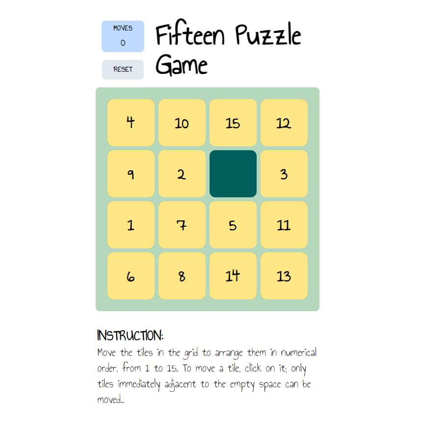

# Fifteen Puzzle Game

Move tiles in grid to order them from 1 to 15

## Instruction

Move the tiles in the grid to arrange them in numerical order, from 1 to 15. To move a tile, click on it; only tiles immediately adjacent to the empty space can be moved.

## Description 

The 15-puzzle is a sliding puzzle that consists of a frame of numbered square tiles in random order with one tile missing.

## Screenshot 

<p align="center">
  
</p>

## Development

Before doing anything, start with installing npm dependencies using `npm install`.

Then to start development mode with hot module reloading, run:
```bash
npm start
```
This will start the development server after compiling the project.

To build the application and make ready for production:
```
npm run build
```
This command builds the application and puts the generated files into the `deploy` directory (can be overwritten in webpack.config.js).
